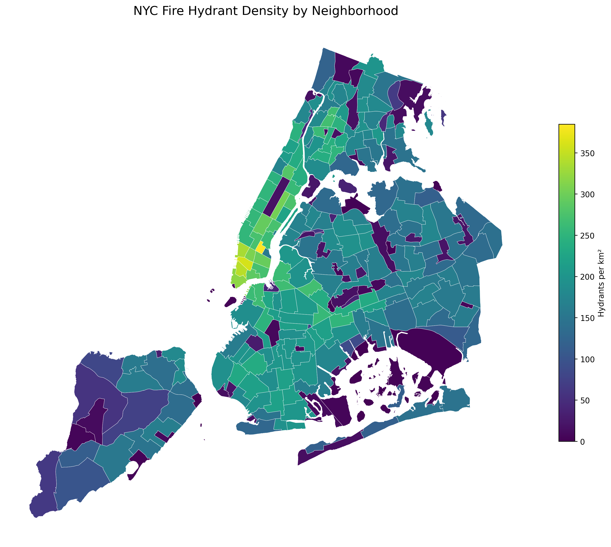

# NYC Fire Hydrant Spatial Analysis

A spatial analysis of how NYC's ~110,000 fire hydrants are distributed across its neighborhoods —
where hydrant density is highest and lowest, and how much of each neighborhood actually falls
within realistic firefighting reach of a hydrant. The same analysis is built twice: once in Python
(GeoPandas, for exploration and the interactive map) and once in PostGIS (SQL, for the heavier
buffer/union/intersection coverage query).

## Datasets

Both datasets are sourced from NYC Open Data and provided as GeoJSON in `data/raw/` (git-ignored —
not committed to the repo):

| Dataset | File | Rows | Geometry | Native CRS |
|---|---|---|---|---|
| Fire hydrants | `hydrants.geojson` | 109,725 | Point | EPSG:4326 |
| Neighborhood Tabulation Areas (NTAs) | `neighborhoods.geojson` | 262 | MultiPolygon | EPSG:4326 |

Only the columns actually used in the analysis are kept: `boro`, `latitude`, `longitude` for
hydrants; `boroname`, `borocode`, `ntaname`, `nta2020`, `countyfips` for neighborhoods.

## Process

### Part 1 — Python / GeoPandas (`analysis.ipynb`)

1. **Load** — read both GeoJSON files, trim to the needed columns, confirm shapes and CRS.
2. **Project** — reproject both layers from EPSG:4326 (degrees) to EPSG:2263 (NY State Plane, feet),
   a projected CRS, since accurate distance/area math isn't possible in degrees.
3. **Spatial join** — `gpd.sjoin(..., predicate='within')` tags every hydrant with the neighborhood
   polygon that contains it. Hydrants with no containing polygon (piers, causeways, unmapped land)
   are kept visible as an `unmatched` set rather than silently dropped — **31 of 109,725** hydrants
   fell into this category.
4. **Normalize** — compute each neighborhood's area in km² and divide hydrant count by area to get
   **hydrants per km²**. Neighborhoods with (near) zero mapped land area are guarded against
   divide-by-zero and marked as missing data rather than `inf`.
5. **Visualize** — an interactive Folium/Leaflet choropleth (`GeoDataFrame.explore()`), quantile-
   classified, with a "No data" style for the guarded neighborhoods. Exported to
   `images/hydrant_density_map.html` and `images/density_choropleth.png`; the final density table
   is saved to `data/processed/hydrant_density.parquet`.

### Part 2 — PostGIS / SQL (`analysis.sql`)

The same hydrant/neighborhood tables, loaded into a Dockerized PostGIS instance
(`docker/docker-compose.yml`) via `ogr2ogr`, then queried directly — no pandas, everything pushed
down to the database. Five queries, each building on the last:

1. **Filter** — sanity-check row counts/SRID/geometry type for both tables, then list all Manhattan
   neighborhoods.
2. **Spatial join** — `ST_Contains(neighborhood.geom, hydrant.geom)` matches each hydrant to its
   containing neighborhood; a second query surfaces hydrants matched to nothing, mirroring the
   notebook's `unmatched` check.
3. **Aggregate** — `LEFT JOIN` + `GROUP BY` counts hydrants per neighborhood, keeping neighborhoods
   with zero hydrants in the result instead of dropping them.
4. **Normalize** *(headline result)* — `ST_Area(ST_Transform(geom, 2263))` converts each polygon's
   area to km², then hydrant count is divided by area for density per km² — the SQL equivalent of
   the notebook's Part 1, computed entirely in the database.
5. **Buffer + Union + Intersection** *(the deeper finding)* — buffers every hydrant by a 100m
   service radius (`ST_Buffer`, in EPSG:2263 feet), unions all buffers into one coverage geometry,
   intersects that with each neighborhood polygon, and divides the intersected area by the
   neighborhood's total area to get **% of each neighborhood within 100m of a hydrant**. This is
   the question density alone can't answer: a neighborhood can have a high hydrant *count* per km²
   while still leaving pockets of land more than 100m from the nearest one (or vice versa).

Two GIST spatial indexes (`hydrants.geom`, `neighborhoods.geom`) are created up front — without
them, the point-in-polygon joins in queries 2–5 fall back to a full scan against all 262 polygons
for every one of the 109,725 hydrants.

## Results

Using the notebook's density calculation, hydrant density per km² is heavily concentrated in
**Manhattan**, unsurprising given its density of both buildings and fire risk:

| Rank | Neighborhood | Borough | Hydrants | Density (per km²) |
|---|---|---|---|---|
| 1 | Gramercy | Manhattan | 269 | 384.73 |
| 2 | SoHo–Little Italy–Hudson Square | Manhattan | 432 | 360.00 |
| 3 | Tribeca–Civic Center | Manhattan | 433 | 343.25 |
| 4 | West Village | Manhattan | 447 | 333.74 |
| 5 | Financial District–Battery Park City | Manhattan | 570 | 319.11 |

At the other end, several large, sparsely built neighborhoods — parks, cemeteries, wetlands (e.g.
Shirley Chisholm State Park, The Evergreens Cemetery, Jamaica Bay (West)) — have close to zero
hydrants relative to their area, some with none at all. These aren't really comparable to dense
residential neighborhoods; they're mostly undeveloped/protected land, which is part of why the
buffer coverage query (SQL query 5) matters more than raw density for judging actual firefighting
reach.

The interactive version (`images/hydrant_density_map.html`) makes the Manhattan-vs-outer-borough
gradient immediately visible; the static choropleth below is the same result:



## Key learnings

- **Never do area/distance math in a geographic CRS.** EPSG:4326 is degrees, not meters/feet —
  every area and buffer calculation in this project required an explicit reprojection to a
  projected CRS first (EPSG:2263 for area, matching NY State Plane; buffers need a metric-accurate
  CRS if the radius is specified in meters).
- **Guard divide-by-zero explicitly, don't let it silently become `inf`.** A few neighborhoods have
  ~zero mapped land area; without a guard, their density blows up and corrupts both sorting and the
  choropleth's quantile bins.
- **`LEFT JOIN`/`how='left'`, not inner join, when "zero" is a valid answer.** Neighborhoods with no
  hydrants are a real (and interesting) data point, not a row to be dropped.
- **Always surface the "didn't match anything" case.** Both the notebook and SQL versions keep an
  explicit unmatched/non-contained check rather than letting a join quietly discard rows.
- **Spatial indexes matter as soon as a join isn't row-for-row.** A ~110k x 262 point-in-polygon
  join is trivial with a GIST index and prohibitively slow without one.
- **Density and coverage answer different questions.** A high hydrant count per km² doesn't
  guarantee every corner of a neighborhood is close to one — that's exactly what the buffer/union/
  intersection query in `analysis.sql` was built to check, and it's the more operationally useful
  number for a fire department than density alone.

## Project structure

```
├── analysis.ipynb          # Python/GeoPandas analysis + interactive map
├── analysis.sql            # PostGIS analysis (5 queries, same story in SQL)
├── docker/
│   └── docker-compose.yml  # Local PostGIS instance for analysis.sql
├── data/
│   ├── raw/                # Source GeoJSON (git-ignored)
│   └── processed/          # hydrant_density.parquet (notebook output)
└── images/
    ├── density_choropleth.png
    └── hydrant_density_map.html
```

## Running it

**Notebook:** open `analysis.ipynb` with the project's `.venv` kernel and run all cells — it reads
directly from `data/raw/`.

**SQL:** start the database (`docker compose up -d` from `docker/`), load both GeoJSON files into
it with `ogr2ogr` (targeting tables `hydrants` and `neighborhoods`), then run `analysis.sql` section
by section in `psql` or pgAdmin.
